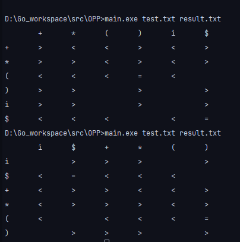

# 算符优先文法

## 1. 实验环境

- 操作系统:  Windows 10 家庭版20H2
- 编程语言:  Go
- 编译器版本:  go 1.5.10

## 2. 设计思路

1. 伪代码

   ```
   1. 为文法每个非终结符A定义两个集合
   FIRSTVT(A) = {b | A->*b···或A->*Bb···, b∈VT，B∈VN}
   LASTVT(A) = {a | A->···a或A->···aB, a∈VT，B∈VN}
   2. 执行程序
   for （每个产生式A->x1x2···xn)
   for (i=1; i<=n-1; i++) {
   	if (xi∈VT 且xi+1∈VT) 置xi=xi+1
   	if (i<=n-2 且 xi∈VT、xi+2∈VT，而xi+1属于VN) 置xi=xi+2;
   	if (xi∈VT，xi+1∈VN)
   		for (FIRSTVT(xi+1)中的每个b)置xi<b;
   	if (xi∈VN, xi+1∈VT)
   		for (LASTVT(xi)中的每个a)置a>xi+1;
   }
   ```

   2.代码说明

   主要使用了如下函数及结构体

   ```go
   type term struct 
   type nonterm struct 
   func readFile(path string) []string
   func getNoTerm(rules []string) map[string]nonterm
   func getTerm(rules []string, nontermlist map[string]nonterm) map[string]term
   func getVT(rules []string, nontermlist map[string]nonterm)
   func appendVT(list1 []string, list2 []string) []string
   func find(list1 []string, target string) (int, bool)
   func genTable(rules []string, nontermlist map[string]nonterm, termlist								map[string]term, strToIdx map[string]int) (map[string][]byte, bool)
   func insertFirst(preSymbol []string, table map[string][]byte, VT []string, strToIdx 				map[string]int, symbol byte ) bool
   func insertLast(preSymbol byte, table map[string][]byte, VT []string, strToIdx 						map[string]int, symbol byte) bool
   func output(strToIdx map[string]int, res map[string][]byte, size int)
   func writeToFile(strToIdx map[string]int, res map[string][]byte, size int, path 					string)
   func main()
   ```

   1. 结构体

      ``` go
      type nonterm struct {
      	first []string
      	last []string
      }
      ```

      nonterm表示非终结符类型，含有两个成员first和last，类型均为字符串数组，用于记录每个非终结符的FIRSTVT和LASTVT

      term表示终结符类型，含有两个成员first和last，成员并未实际使用到，仅仅用于和nonterm保持统一格式

   2. `func main()`

      main函数为程序的主入口，用于调用其他函数。要求在运行可执行程序时输入两个路径参数，分别为文法文件所在的路径和输出结果的路径。

      `nontermlist`为哈希表，键为字符串类型，保存非终结符，值为nonterm类型，保存与终结符对应的FIRSTVT和LASTVT集合。

      `termlist`为哈希表，键为字符串类型，保存终结符，值为term类型，无实际意义。

      `res`为哈希表，键为字符串类型，保存终结符，值为`[]byte`，即字节数组，用于保存对应的算符优先级符号。

   3. `func readFile(path string) []string`

      该函数用于从path指定的路径中按行读取对应的文本文件，每一行对应于一条文法规则，将结果保存在`[]string`中，`[]string`中每一个元素对应于一条文法规则，将结果返回主函数。

   4. `func getNoTerm(rules []string) map[string]nonterm`

      该函数从文法规则中读取非终结符号，保存在`map[string]nonterm`数据结构中，其中map每一键值对初始化为如下格式:`termlist[string(rules[i][0])] = nonterm{make([]string, 0), make([]string, 0)}`

      由于所有的非终结符必然会在文法规则的最左边出现，因此只需循环读取rules每一元素的第一个字符放入map即可。

      最后将map返回主函数。

   5. `func getTerm(rules []string, nontermlist map[string]nonterm) map[string]term `

      此函数用于从文法规则中读取非终结符号填入`map[string]term`，并按照规则将非终结符直接填入`nontermlist`中（例如按照规则`T -> T * F | F`将*填入到`nontermlist[T].first`中，而暂时不将`FIRSTVT(F)`合并到`nontermlist`中）。

      在扫描完所有的文法规则后，返回对应的termlist。

      依次扫描每一条规则，每条规则对应的循环中定义如下临时变量:

      - `nonSymbol := rules[i][0]`记录当前语法规则对应的非终结符
      - `flag := false` 用于标志读取到的终结符号是否应该加入到FIRSTVT中，flag为false表示当前读取到的终结符为第一个终结符，应该加入到FIRSTVT中并将flag置为true.
      - `lastTerm = ""`用于记录最右侧的终结符，并在当前语句扫描完后将其加入到`LASTVT`中
      
      从左往右扫描每一条文法规则中的每一个符号:
      
      - 大写字母: 非终结符，跳过
      
      - 空格: 跳过
      
      - `rules[i][j]`为'-'并且`rules[i][j+1]`为'>'，说明读取到了箭头，当前扫描到了文法规则的右半部分, 令j+1，跳过
      
      - '|':   说明当前文法规则读取完毕，将lastTerm对应的终结符添加到nonSymbol的LASTVT集合中，如下所示:
      
        ```go
        temp := append(nontermlist[string(nonSymbol)].last, lastTerm)
        nontermlist[string(nonSymbol)] = nonterm{nontermlist[string(nonSymbol)].first, temp}
        ```
      
        将lastTerm和flag重置，继续循环
      
      - 终结符: 将终结符加入到termlist中，`termlist[string(rules[i][j])] = term{make([]string, 0), make([]string, 0)}`
      
        若flag为false,则将该终结符加入到FIRSTVT中，并将flag置为true。将lastTerm替换为当前读取到的终结符。
      
      最后将$添加到termlist中，返回termlist
      
   6. `func getVT(rules []string, nontermlist map[string]nonterm)`
   
      该函数用于按照语法规则，生成完整的FIRSTVT和LASTVT
   
      定义如下变量
   
      - `var flag bool ` : 用于标识当前是否已扫描到文法规则的右半部分
      - `var nonsymbol string`: 用于记录当前文法规则左部的非终结符
      - `var firstflag bool`: 用于标识当前读取的非终结符的FIRSTVT是否应该加入到nonsymbol对应的FIRSTVT中
      - `var lastsymbol string`: 用于记录当前读取的文法规则最右侧的非终结符
      - `var lastflag bool`: 用于标识lastsymbol的LASTVT集合是否应当加入到nonsymbol的LASTVT中。
   
      从左至右扫描每一条文法规则:
   
      - `rules[i][j]`为'-'并且`rules[i][j+1]`为'>'，说明读取到了箭头，当前扫描到了文法规则的右半部分, 令j+1，false 置为true, 跳过
      - 空格: 跳过
      - '|': 若lastflag为true, 调用appendVT函数，将nonsymbol的LASTVT与lastsymbol的LASTVT合并。将lastflag和firstfalg重置为false，lastsymbol重置为空串。
      - 非终结符: lastflag置为true, 将其存入lastsymbol，若firstflag为false，则通过appendVT函数将该终结符的LASTVT集合与nonsymbol的LASTVT集合合并。
      - 终结符: firstflag 置为true，lastflag置为false
   
   7. `func appendVT(list1 []string, list2 []string) []string`
   
      该函数用于将list2与list1合并，返回合并后的结果，实现如下:
   
      ```go
      sort.Sort(sort.StringSlice(list1))
      sort.Sort(sort.StringSlice(list2))
      var res []string
      for i:=0; i< len(list2); i++ {
      	if _, ok := find(list1, list2[i]); !ok {
      		res = append(res, list2[i])
      	}
      }
      res = append(res, list1...)
      return res
      ```
   
   8. `func find(list1 []string, target string) (int bool)`
   
      该函数用于查找target在list1中的位置，如果查找到返回下标和true,否则返回-1和false。实现如下:
   
      ```go
      func find(list1 []string, target string) (int, bool) {
      	for i:=0; i<len(list1); i++ {
      		if list1[i] == target {
      			return i, true
      		}
      		if list1[i] > target {
      			break
      		}
      	}
      	return -1, false
      }
      ```
   
   9. `func genTable(rules []string, nontermlist map[string]nonterm, termlist map[string]term, strToIdx map[string]int) (map[string][]byte, bool)`
   
      根据文法规则、nontermlist、termlist生成对应的算符优先分析表。
   
      strToIdx参数用于按照指定的顺序向map中插入值。
   
      首先生成\$非终结符对应的算符优先分析表，\$<FIRSTVT(E), LASTVT(E)>\$.
   
      依次循环扫描每一条规则:
   
      定义两个变量: 
   
      - `var preSymbol []string`: 用于保存前面出现的终结符
      - `var preNonSymbol []byte`: 用于保存前面出现的非终结符
   
      - `flag := false`: 用于标识当前是否已经读取到规则->右侧
   
      从左至右扫描规则的每一个符号:
   
      - 空格: 跳过
   
      - '|': 重置preSymbol和preNonSymbol
   
        ```go
        preSymbol = nil
        preNonSymbol = nil
        ```
   
      - 非终结符: 有preSymbol中的元素< 该终结符的FIRSTVT集合， 调用insertFirst函数。若返回false,说明文法出现二义性。
   
        将当前符号插入到preNonSymbol中
   
      - 终结符: 有preNonSymbol对应的LASTVT中的元素小于当前终结符，调用insertLast函数，若返回false,说明文法出现二义性。
   
        若preSymbol中还有其他元素，则将preSymol中的元素与当前终结符优先级相同，置table中对应位为=
   
        将当前符号插入到preSymbol中，preNonSymbol置为nil
   
      返回table
      
   10. `func insertFirst(preSymbol []string, table map[string][]byte, VT []string, strToIdx map[string]int, symbol byte ) bool`
   
       置preSymbol中的元素优先级<VT中的元素，实现如下:
   
       ```go
       for _, s := range preSymbol {
       	for _, i := range VT {
       		//fmt.Println(string(table[s][strToIdx[i]]))
       		if table[s][strToIdx[i]] != byte(0){
       			return false
       		}
       		table[s][strToIdx[i]] = symbol
       	}
       }
       return true
       ```
   
   11. `func insertLast(preSymbol byte, table map[string][]byte, VT []string, strToIdx map[string]int, symbol byte) bool`
   
       置preSymbol中的元素优先级> VT中的元素，实现如下:
   
       ```go
       for _, i := range VT {
       	if table[i][strToIdx[string(preSymbol)]] != byte(0) {
       		return false
       	}
       	table[i][strToIdx[string(preSymbol)]] = symbol
       }
       return true
       ```
   
   12. `func output(strToIdx map[string]int, res map[string][]byte, size int)`
   
       以表格形式输出算符优先分析表至命令行
   
   13. `func writeToFile(strToIdx map[string]int, res map[string][]byte, size int, path string)`
   
       将算符优先分析表输入到path对应的文件，实现如下:
   
       ```go
       func writeToFile(strToIdx map[string]int, res map[string][]byte, size int, 		path string) {
       	file, err := os.OpenFile(path, os.O_WRONLY|os.O_CREATE, 0666)
       	if err != nil {
       		fmt.Println(err)
       		return
       	}
       
       	defer func(file *os.File) {
       		err := file.Close()
       		if err != nil {
       			fmt.Println(err)
       		}
       	}(file)
       
       	idxToStr := make([]string, size)
       	for k,v := range strToIdx {
       		idxToStr[v] = k
       	}
       
       	fmt.Fprintf(file, " \t")
       	for _, v := range idxToStr {
       		_, err2 := fmt.Fprintf(file, "%s \t", v)
       		if err2 != nil {
       			return
       		}
       	}
       
       	for _, v := range idxToStr {
       		fmt.Fprintf(file, "\n")
       		fmt.Fprintf(file, "%s \t", v)
       		for _, j := range res[v] {
       			if j == byte(0) {
       				fmt.Fprintf(file, " \t")
       			} else {
       				fmt.Fprintf(file,"%s \t", string(j))
       			}
       		}
       	}
       }
       ```

## 3. 实验结果

1. 测试文法1

   预先将文法写入在test.txt中，在命令行中输入`main.exe test.txt result.txt`运行exe文件，结果输出到result.txt中，得到如下结果:

   

2. 测试文法2

   将文法写入到test2.txt中，在命令行中输入`main.exe test2.txt result2.txt`运行exe文件，结果输出到result2.txt中，得到如下结果:

   

[注]：算符优先分析表定义在`map[string][]byte`数据结构中，map本身无序，在代码中仅保证了分析表行和列的排列顺序是一致的，但并未保证每次运行exe文件输出的行列的排列顺序都相同，但对应的算符优先关系相同。如图所示:

